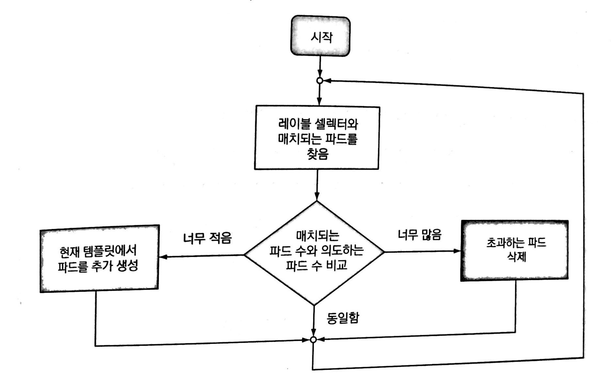

# 4. 레플리케이션과 그 밖의 컨트롤러: 관리되는 파드 배포

* 쿠버네티스의 파드는 배포 가능한 기본 단위
* 파드를 수동이 아닌 자동으로 관리하고 싶다면 파드를 직접 생성하는 것이 아닌 레플리케이션 컨트롤러 혹은 디플로이먼트와 같은 유형의 리소스를 생성하여 실제 파드를 생성할 것

<br>

## 4.1 파드를 안정적으로 유지하기

* 쿠버네티스를 사용하면서 얻을 수 있는 주요 이점은 쿠버네티스에 컨테이너 목록을 제공하면 컨테이너를 클러스터 어딘가에서 계속 실행되도록 할 수 있다는 것
* 파드가 노드에 스케줄링 되는 즉시, Kubelet은 파드의 컨테이너 실행  
  이후, 컨테이너의 주 프로세스에 문제가 생겨 멈춰도 Kubelet이 컨테이너를 다시 시작
* 때때로 애플리케이션은 프로세스의 크래시 없이도 작동이 중단될 수 있음(OOM이 그 일례)  
  또, 애플리케이션이 무한 루프나 교착 상태에 빠져 응답을 하지 않는 상황이 존재할 수 있음  
  이럴 때는 내부의 기능에 의존하지 않고 외부에서 상태를 체크해야 함

### 4.1.1 라이브니스 프로브 소개

* 쿠버네티스는 라이브니스 프로브(liveness probe)를 통해 컨테이너가 살아 있는지 확인할 수 있음
* 파드의 스펙에 각 컨테이너의 라이브니스 프로브를 지정 가능
* 쿠버네티스는 주기적으로 프로브를 실행하고 프로브가 실패할 경우 컨테이너를 다시 시작
* 쿠버네티스는 세 가지 메커니즘을 사용하여 컨테이너에 프로브를 실행
  * HTTP GET 프로브는 지정한 IP 주소, 포트, 경로에 HTTP GET 요청을 수행  
    프로브가 응답으로 오류 코드를 주지 않는 경우 성공  
    반대로 오류 응답 코드를 주거나 전혀 응답하지 않으면 실패
  * TCP 소켓 프로브는 컨테이너의 지정된 포트에 TCP 연결을 시도  
    연결에 성공하면 프로브 성공, 실패하면 컨테이너 다시 시작
  * Exec 프로브는 컨테이너 내의 임의의 명령을 실행하고 명령의 종료 상태를 확인  
    상태 코드가 0이면 성공, 다른 모든 코드는 실패

### 4.1.2 HTTP 기반 라이브니스 프로브 생성

> 생략

### 4.1.3 동작 중인 라이브니스 프로브 확인

* 이전 컨테이너가 종료된 이유를 파악하려는 경우 `--previous` 옵션을 사용

* `kubectl describe po kubia-liveness` 를 통해 컨테이너가 다시 시작한 내용을 볼 수 있음

  ```yaml
  Name:         kubia-liveness
  Namespace:    default
  Priority:     0
  Node:         minikube/192.168.49.2
  Start Time:   Thu, 23 Sep 2021 22:56:37 +0900
  Labels:       <none>
  Annotations:  <none>
  Status:       Running
  IP:           172.17.0.3
  IPs:
    IP:  172.17.0.3
  Containers:
    kubia:
      Container ID:   docker://768d674268db1ee4d21a8a7a058eb2759d5821d5d8de615f6ffc45efe1ffca71
      Image:          luksa/kubia-unhealthy
      Image ID:       docker-pullable://luksa/kubia-unhealthy@sha256:5c746a42612be61209417d913030d97555cff0b8225092908c57634ad7c235f7
      Port:           <none>
      Host Port:      <none>
      State:          Running
        Started:      Thu, 23 Sep 2021 22:59:20 +0900
      Last State:     Terminated
        Reason:       Error
        Exit Code:    137
        Started:      Thu, 23 Sep 2021 22:57:35 +0900
        Finished:     Thu, 23 Sep 2021 22:59:17 +0900
      Ready:          True
      Restart Count:  1
      Liveness:       http-get http://:8080/ delay=0s timeout=1s period=10s #success=1 #failure=3
      Environment:    <none>
      Mounts:
        /var/run/secrets/kubernetes.io/serviceaccount from kube-api-access-wtvcg (ro)
        

* 종료 코드는 128 + X 로 나타나며 137이라면 128 + 9 이므로 강제 종료됨을 알 수 있음

### 4.1.4 라이브니스 프로브의 추가 속성 설정

* `kubectl describe`는 라이브니스 프로브에 관한 추가적인 정보도 표시

  ```yaml
  Liveness: http-get http://:8080/ delay=0s timeout=1s period=10s #success=1 #failure=3
  ```

  * delay 부분은 컨테이너가 시작된 후 바로 프로브가 시작되는 것을 의미
  * timeout은 컨테이너가 설정된 시간안에 응답해야 함(그렇지 않으면 프로브가 실패한 것으로 간주)
  * preiod는 컨테이너는 10초마다 프로브를 실행
  * failure는 프로브가 3번 연속 실패하면 컨테이너가 다시 시작

* 이러한 추가적인 매개변수는 프로브를 정의할 때 지정할 수 있음

* 라이브니스 프로브에 초기 지연 설정을 하려면 `initialDelaySeconds` 속성을 추가  
  만약 이를 설정하지 않으면 프로브는 컨테이너가 시작되자마자 프로브를 시작  
  대부분 이러한 상황일 때는 애플리케이션이 요청을 받을 준비가 돼 있지 않기 때문에 프로브가 실패  
  따라서 `kubectl describe`로 잘 확인할 것

### 4.1.5 효과적인 라이브니스 프로브 생성

* 운영 환경에서 실행 중인 파드는 반드시 라이브니스 프로브를 정의해야 하고 이를 설정하지 않으면 쿠버네티스가 애플리케이션이 살아 있는지를 알 수 있는 방법이 없음

#### 라이브니스 프로브가 확인해야 할 사항

* 위 예제 보다 한 발 나아가 라이브니스 프로브를 위해 특정 URL 경로(`/health`)에 요청하도록 프로브를 구성할 수 있음
* 라이브니스 프로브는 애플리케이션 내부만 체크, 외부 요인의 영향을 받지 않도록 해야 함  
  예를들어 데이터베이스를 연결할 수 없을 때 라이브니스 프로브는 실패를 반환해서는 안됌  
  만약, 실패라면 서버를 재시작 할텐데 어차피 연결할 수 없는건 똑같음

#### 프로브를 가볍게 유지하기

* 라이브니스 프로브는 너무 많은 연산 리소스를 사용해서는 안되며, 완료하는데 오래 걸리면 안됌
* 기본적으로 프로브는 비교적 자주 실행되며 1초 내에 완료
* 만약 무겁게 만들면 메인 애플리케이션 프로세스에서 사용할 수 있는 CPU 시간이 줄어들게 됨

#### 프로브에 재시도 루프를 구현하지 마라

* 프로브의 실패 임곗값을 설정할 수 있으며, 실패를 간주하기 전에 이미 많은 재시도를 함  
  따라서 자체적인 재시도 루프를 구현하는 것은 헛수고

#### 라이브니스 프로브 요약

* 컨테이너의 크래시가 나거나 라이브니스 프로브가 실패한 경우 컨테이너를 재시작하는 작업은 파드를 호스팅하는 노드의 Kubelet에서 수행하며, 마스터에서 실행 중인 쿠버네티스 컨트롤 플레인 구성 요소는 관여 X
* 노드 자체에 크래시가 발생한 경우 노드 크래시로 중단된 모든 파드의 대체 파드를 생성하는 것은 컨트롤 플레인의 몫
* kubelet은 노드에서 실행되므로 노드 자체가 고장나면 아무것도 할 수 없음

<br>

## 4.2 레플리케이션 컨트롤러 소개

* 레플리케이션 컨트롤러는 쿠버네티스 리소스로서 파드가 항상 실행되도록 보장
* 어떤 이유에서든지 파드가 사라지면 사라진 파드를 감지해 교체 파드를 생성
* 레플리케이션 컨트롤러는 파드의 여러 복제본을 작성하고 관리하기 위한 것

### 4.2.1 레플리케이션 컨트롤러 동작

* 실행 중인 파드 목록을 지속적으로 모니터링하고, 특정 유형의 실제 파드 수가 의도하는 수와 일치하는지 항상 확인  
  (누군가가 일부러 파드를 죽이거나, 생성하면 의도하는 수와 다름)
* 레플리케이션 컨트롤러는 특정 레이블 셀렉터와 일치하는 파드 세트에 동작

#### 컨트롤러 조정 루프 소개



#### 레플리케이션 컨트롤러의 세 가지 요소 이해

* 레이블 셀렉터

  > 레플리케이션 컨트롤러의 범위에 있는 파드를 결정

* 레플리카 수

  > 실행할 파드의 의도하는 수 지정

* 파드 템플릿

  > 새로운 파드 레플리카를 만들 때 사용

#### 컨트롤러의 레이블 셀렉터 또는 파드 템플릿 변경의 영향 이해

* 레이블 셀렉터와 파드 템플릿을 변경해도 기존 파드에 영향을 미치지 않음
* 레이블 셀렉터 변경시 레플리케이션 컨트롤러 범위를 벗어나므로 해당 파드 관리 중지
* 템플릿은 새 파드를 생성할 때만 영향을 미침

#### 레플리케이션 컨트롤러 사용 시 이점

* 기존 파드가 사라지면 새 파드를 시작해 파드가 항상 실행되도록 함
* 클러스터 노드에 장애가 발생하면 장애가 발생한 노드에서 실행 중인 모든 파드에 관한 교체 복사본 생성
* 수동 또는 자동으로 파드를 쉽게 수평으로 확장 가능

### 4.2.2 레플리케이션 컨트롤러 생성

* 템플릿의 파드 레이블은 레플리케이션 컨트롤러의 레이블 셀렉터와 완전히 일치해야 함  
  그렇지 않으면 새 파드를 무한정 생성
* 셀렉터를 지정하지 않으면 템플릿의 레이블로 자동 설정
* 레플리케이션 컨트롤러를 정의할 때 파드 셀렉터를 지정하지 않는 것을 권장

### 4.2.3 레플리케이션 컨트롤러 작동 확인

> 생략

#### 삭제된 파드에 관한 레플리케이션 컨트롤러의 반응 보기

> 생략

#### 레플리케이션 컨트롤러 정보 얻기

> 생략

#### 컨트롤러가 새로운 파드를 생성한 원인 정확히 이해하기

* 컨트롤러는 삭제 그 자체에 대응하는 것이 아닌 결과적인 상태에 대응하는 것
* 삭제되는 파드에 대해 컨트롤러는 즉시 통지 받지만, 해당 통지가 대체 파드를 생성하는 것이 아닌 실제 파드 수를 확인하도록 함

#### 노드 장애 대응

* 노드에 장애가 발생한 경우 즉각적인 개발자의 개입이 필요하지 않고 스스로 치유

### 4.2.4 레플리케이션 컨트롤러 범위 안팎으로 파드 이동하기

* 컨트롤러가 생성한 파드는 어떤 식으로든 RC와 묶이지 않음
* RC는 레이블 셀렉터와 일치하는 파드만을 관리
* 파드의 레이블을 변경하면 수동으로 만든 다른 파드처럼 됨

#### 컨트롤러에서 파드를 제거하는 실제 사례

* 특정 파드에 어떤 작업을 하려는 경우 RC 범위에서 제거하면 작업이 수월

  ex) 파드 디버깅

#### 레플리케이션 컨트롤러의 레이블 셀렉터 변경

* RC의 레이블 셀렉터를 변경하면 새로운 파드를 생성함
* 쿠버네티스는 RC의 레이블 셀렉터를 변경하도록 허용하지만, 다른 리소스들의 경우 X

### 4.2.5 파드 템플릿 변경

* RC의 파드 템플릿은 언제든지 수정 가능
* 파드 템플릿 변경 → RC에서 새로운 파드 생성(기존 파드는 영향 X)

### 4.2.6 수평 파드 스케일링

* 원하는 복제본 수를 변경하는 것은 매우 간단
* RC 리소스의 replicas 필드 값을 변경하기만 해도 됨

#### 레플리케이션 컨트롤러 스케일 업하기

```
kubectl scale rc kubia --replicas=10

kubectl edit rc kubia 	→ 편집기 사용
```

* 다음과 같은 명령어로 스케일 업을 할 수 있음

#### 레플리케이션 컨트롤러 삭제

* `kubectl delete` 를 통해 RC를 삭제하면 파드도 같이 삭제
* 하지만, 따로 `--cascade=false` 옵션을 통해 같이 삭제하지 않을 수 있음

<br>

## 4.3 레플리케이션 컨트롤러 대신 레플리카셋 사용하기

* RC가 노드 장애시 파드를 재스케줄링하는 유일한 구성 요소였으나, 레플리카셋이란 유사한 리소스 도입
* 차세대 RC이며, 완전히 대체할 것

### 4.3.1 레플리카셋과 레플리케이션 컨트롤러 비교

* 레플리카셋은 RC와 똑같이 동작하지만 더 풍부한 표현식을 사용하는 파드 셀렉터가 존재
* RC의 레이블 셀렉터는 특정 레이블이 있는 파드만 매칭하는 반면, 레플리카셋의 셀렉터는 특정 레이블이 없는 파드나 레이블의 값과 상관없이 특정 레이블 키를 갖는 파드를 매칭

### 4.3.2 레플리카셋 정의하기

* 레플리카셋은 v1 API의 일부가 아니므로 적절한 apiVersion 지정
* 파드가 가져야 하는 레이블은 selector.matchLables 아래 지정

### 4.3.3 레플리카셋 생성 및 검사

* 레플리카셋은 RC와 다르지 않음

### 4.3.4 레플리카셋의 더욱 표현적인 레이블 셀렉터 사용하기

* matchExpressions를 사용하면 더욱 풍부한 표현을 할 수 있음

  ```yaml
  selector:
  	matchExpressions:
  	-	key: app		# key가 app인 레이블을 포함
  		operator: In
  		values:
  		-	kubia		# 레이블의 값은 kubia여야 함
  ```

* 네 가지 유효 연산자

  1. In

     > 레이블의 값이 지정된 값 중 하나와 일치

  2. NotIn

     > 레이블 값이 지정된 값과 일치하지 않아야 함

  3. Exists

     > 파드는 지정된 키를 가진 레이블이 포함돼야 함  
     > 값 필드를 지정하지 않아야 함

  4. DoesNotExists

     > 파드에 지정된 키를 가진 레이블이 포함돼 있지 않아야 함  
     > 값 필드를 지정하지 않아야 함

### 4.3.5 레플리카셋 정리

* 레플리카셋은 RC를 삭제하는 방법과 같음

<br>

## 4.4 데몬셋을 사용해 각 노드에서 정확히 한 개의 파드 실행하기

* 클러스터의 모든 노드에, 노드당 하나의 파드만 실행하기 원할 경우(로그 수집기, 리소스 모니터, 쿠버네티스의 kube-proxy 프로세스) 데몬셋을 사용

### 4.4.1 데몬셋으로 모든 노드에 파드 실행하기

* 데몬셋에 의해 생성되는 파드는 타깃 노드가 이미 지정돼 있고 쿠버네티스 스케줄러를 건너뛰는 것을 제외하면 RC와 레플리카셋과 굉장히 유사
* 데몬셋에는 원하는 복제본 수라는 개념이 없음
* 노드가 다운되면 데몬셋은 다른 곳에서 파드를 생성하지 않음  
  누군가 실수로 파등 중하를 삭제해 노드에 데몬셋의 파드가 없는 경우에도 마찬가지

### 4.4.2 데몬셋을 사용해 특정 노드에서만 파드를 실행하기

* 데몬셋을 일부 노드에서만 실행하도록 지정하지 않으면 모든 노드에 파드를 배포
* 데몬셋 정의 일부인 파드 템플릿에서 node-Selector 속성을 지정하면 됨

#### 예제를 사용한 데몬셋 설명

> 생략

#### 데몬셋 YAML 정의 생성

> 생략

#### 데몬셋 생성

> 생략

#### 필요한 레이블을 노드에 추가하기

* `kubectl label node minikube disk=ssd` 라는 명령어로 노드에 레이블 추가 가능

#### 노드에서 레이블 제거하기

* 레이블을 변경하면 파드는 종료
* 데몬 셋을 삭제한다면 해당 파드도 종료

<br>

## 4.5 완료 가능한 단일 태스크를 수행하는 파드 실행

### 4.5.1 잡 리소스 소개

* 쿠버네티스는 잡 리소스로 완료 가능한 테스크(프로세스가 종료되면 다시 시작 X) 기능을 지원
* 위 리소스들과 흡사
* 노드 장애시 다른 리소스들과 같이 재스케줄링되며, 프로제스 자체에 장애가 발생한 경우 잡 컨테이너를 다시 시작할 것인지 설정 가능
* 잡은 작업이 제대로 완료되는 것이 중요한 임시 작업에 유용

### 4.5.2 잡 리소스 정의

> 생략

### 4.5.3 파드를 실행한 잡 보기

* `kubectl create` 명령어로 잡 생성시 즉시 파드 생성
* 파드가 완료될 때 삭제되지 않은 이유는 해당 파드의 로그를 검사할 수 있게 하기 위해서

### 4.5.4 잡에서 여러 파드 인스턴스 실행하기

* 잡은 두 개 이상의 파드 인스턴스를 생성해 병렬 또는 순차적으로 실행하도록 구성 가능
* 잡 스펙에 completions와 parallelism 속성을 설정

#### 순차적으로 잡 파드 실행하기

* completions를 설정하면 잡이 순차적으로 실행
* `completions: 5`로 잡으면 파드 생성되고 완료되는 과정을 5번을 수행
* 파드 중 하나가 실패하면 잡이 새 파드를 생성하므로 전체적으로 다섯개 이상의 파드 생성

#### 병렬로 잡 파드 실행하기

* parallelism 속성을 이용해 병렬로 실행할 파드 수를 지정
* `completions: 5 parallelism: 2` 일 경우, 2개씩 총 5개의 파드를 생성하고 실행

#### 잡 스케일링

* 잡이 실행되는 동안 잡의 parallelism 속성을 변경할 수 있음

### 4.5.5 잡 파드가 완료되는 데 걸리는 시간 제한하기

* 파드 스펙에 activeDeadlineSeconds 속성을 설정해 파드의 실행 시간을 제한할 수 있음
* 파드가 이보다 오래 실행되면 시스템이 종료를 시도하고 잡이 실패한 것으로 간주
* 잡의 매니페스트에서 spec.backoffLimit 필드를 지정해 실패한 것으로 표시하기 전에 재시도 가능(기본값 6)

<br>

## 4.6 잡을 주기적으로 또는 한 번 실행되도록 스케줄링하기

* 지정된 시간 또는 지정된 간격으로 반복실행 해야하는 작업을 리눅스/유닉스 같은 운영체제에서는 크론 작업이라 함
* 쿠버네티스에서도 크론 작업은 크론잡 리소스를 만들어 구성
* 쿠버네티스는 설정된 싲간에 잡 리소스를 크론잡 오브젝트에 설정한 잡 템플릿에 따라 생성

### 4.6.1 크론잡 생성하기

```yaml
apiVersion: batch/v1beta1
kind: CronJob
metadata: 
	name: batch-job-every-fifteen-minutes
spec:
	schedule: "0,15,30,45 * * * *"	# 매시간 0, 15, 30, 45분에 실행
	...
```

* 다음과 같은 설정으로 크론잡 생성

#### 스케줄 설정하기

* 스케줄은 왼쪽에서 오른쪽으로 다섯개의 항목을 갖고 있음
  * 분, 시, 일, 월, 요일
* 매달 첫째날에 30분마다 실행하고 싶으면`0, 30 * 1 * *` 로 스케줄링

### 4.6.2 스케줄된 잡의 실행 방법 이해

* 잡 리소스는 예정된 시간에 크론잡 리소스에서 생성, 잡은 파드를 생성

* 잡이나 파드가 상대적으로 늦게 생성되고 실행될 수 있는데 이를 크론잡 스펙의 startingDeadlineSeconds 필드를 지정해 데드라인을 설정할 수 있음

  ```yaml
  spec:
  	schedule: "0,15,30,45 * * * *"
  	startingDeadlineSeconds: 15
  ```

* 위 예에서는 잡이 예정된 실행 시간에서 15초 이내로 시작하지 않으면 잡이 실패로 간주

* 일반적인 경우 크론잡은 스케줄에 설정한 각 실행에 상상 하나의 잡만 생성하지만, 두개의 잡이 동시에 생성되거나 전혀 생성되지 않을 수 있음

* 전자의 경우 멱등성을 가져야하며, 후자의 경우 다음 번 잡 실행이 이전의 실행에서 완료했어야 하는 작업을 수행하는지 확인

